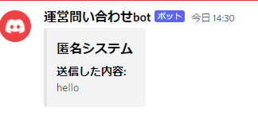
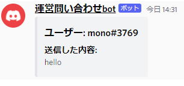

# syocho-inquiry-bot
discordサーバー内の他のチャンネルにメッセージを転送するbot
## Overview
AからBへのメッセージ転送
BからAへのメッセージ転送

AからBへメッセージを送るときは匿名化がされない
BからAへメッセージを送るときは匿名化される

Bからメッセージが送られてきたA視点
  
Aからメッセージが送られてきたB視点
  
## Usage
`git clone https://github.com/mono0218/syocho-inquiry-bot.git`
  `cd syocho-inquiry-bot`
  config.jsonにtokenとチャンネルid二つを記入する
  `npm install`
  `node index.js ` or `node .`

## Licence

[MIT](https://github.com/mono0218/syocho-inquiry-bot/blob/master/LICENSE)